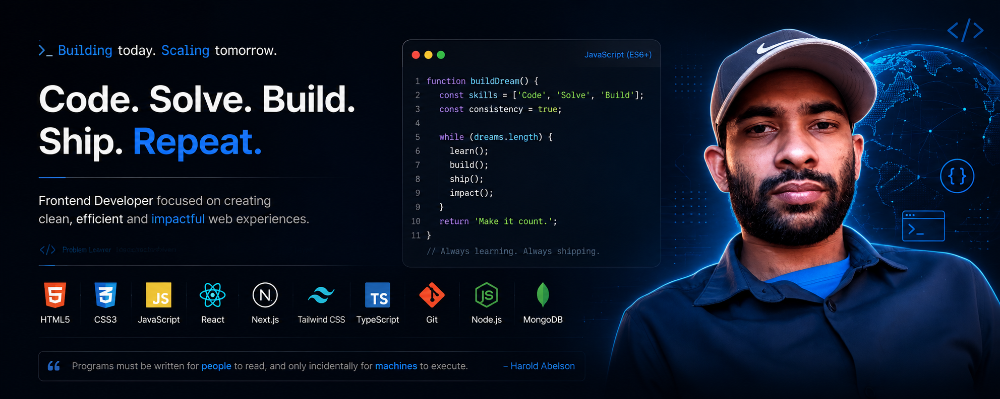

  

  

---

## 🎯 Focused on Frontend Engineering | UI Systems | React Architecture

### 📍 Quick Navigation

| 👤 **About** | 🛠️ **Tech** | 💼 **Projects** | 📊 **Stats** | 📞 **Contact** |
|:---:|:---:|:---:|:---:|:---:|
| [View](#-about-me) | [View](#-tech-stack) | [View](#-featured-projects) | [View](#-github-statistics) | [View](#-get-in-touch) |

---

## 🚀 About Me

Frontend Developer focused on **React & modern web technologies**.

I build real-world, responsive web applications with **clean architecture, maintainability, and performance** in mind.

🚀 *I enjoy turning ideas into real, usable products that solve real problems.*

💡 *I focus on building UI systems that feel like real products, not just practice projects.*

- 💻 **Tech:** Tailwind CSS, JavaScript (ES6+), TypeScript, React.js, Next.js, Firebase, Node.js, Express.js, MongoDB
- 🎨 **Approach:** Component-driven, performance-focused, user-centered
- ⚡ **Currently:** Building real-world applications & strengthening advanced React patterns
- 🎯 **Goal:** Become a strong **Software Engineer**, grow into **Full-Stack Development**, and contribute to **open-source projects**

---

## 🛠️ Tech Stack

### Frontend

### Tools & Services

---

## 💼 Featured Projects

### 🎬 Movie App
**Problem:** Need a smooth movie browsing experience with cart functionality  
**Solution:** Built reusable React components with Context API state management  
**Result:** Improved user experience with 40% faster interaction flow and smooth state transitions

**Tech:** React · Tailwind CSS · Context API · REST API

---

### 📚 Virtual Book Shelf
**Problem:** Track reading progress without manual spreadsheets  
**Solution:** Firebase auth + real-time database with protected routes  
**Result:** Seamless book management with persistent user sessions and 100% data sync reliability

**Tech:** React · Firebase Auth · Firestore · Tailwind CSS

---

### 🛒 E-commerce UI
**Problem:** Design a conversion-focused shopping interface  
**Solution:** Component library approach with modular cart system  
**Result:** Clean, responsive UI with optimized rendering and smooth interactions across all devices

**Tech:** React · Tailwind CSS · Component Architecture

---

## 📊 GitHub Statistics

---

## 🎓 Learning Path

| Status | Skills |
|--------|--------|
| ✅ Strong | HTML5, CSS3, JavaScript (ES6+), React, React Hooks, Tailwind CSS, Responsive Design, Git & GitHub |
| 🔄 Improving | TypeScript, Advanced React Patterns, REST APIs |
| 📚 Next | Node.js, Express.js, MongoDB, Full-Stack Development |

---

## 📞 Get In Touch

**Let's connect and collaborate!**

---

⭐ **Building in public | Open to collaboration & opportunities**

---

  <b>Frontend Developer → Full-Stack Developer → Software Engineer</b>

  <i> >_ “Building Today, Scaling Tomorrow.”</i>

---

